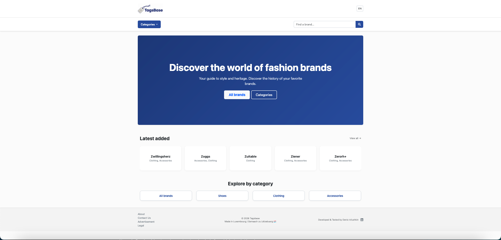

# Tagsbase QA Portfolio

This repository contains the full Testing Infrastructure for the Tagsbase project (a fashion brand directory).

**My Goal:** Show full-cycle QA skills(from test strategy & manual documentation to automated E2E pipeline, CI/CD) and keep the application stable and reliable.

**Live site:** [TagsBase.com](https://www.tagsbase.com)

## Quick Status Badges

TBA soon

## Project Overview

Tagsbase is a directory of fashion brands with:

- Real-time search
- Сategories navigation
- Detailed brand pages

## Testing Approach

- **Manual testing** → documented test plan, test cases, bug reports (/docs)
- **Automated testing** → smoke, UI/E2E, API checks
- **Quality gates** → security (Bandit), linting (Flake8), coverage report
- **CI/CD** → GitHub Actions runs all checks before deploy

## Tech Stack

- **Frontend:** HTML + CSS (Bootstrap)
- **Backend:** Python/Flask
- **Db:** SQlite
- **Testing Framework:** Pytest
- **Browser Automation:** Playwright (Python)
- **Security Scanning:** Bandit
- **Static Analysis:** Flake8
- **Reporting:** Pytest-HTML / Coverage.py
- **CI/CD:** GitHub Actions(Executing tests) → Hosting

## Repository Structure

- `/docs`: Test Plan, Test Cases, Traceability Matrix.
- `/tests/smoke`: High-level health checks.

## What I learned / interesting decisions

- Why I chose Flask instead of FastAPI/Django

## Future plans

- User authentication & favorite brands
- Admin panel for adding new brands
- Search with typos tolerance (fuzzy search)
- Maybe one more language version
- Dark mode
- Db migration

Feel free to explore the docs and tests folders!
Questions, feedback, code review - very welcome.

Please ⭐ if you find this portfolio useful

Last updated: January 2026
